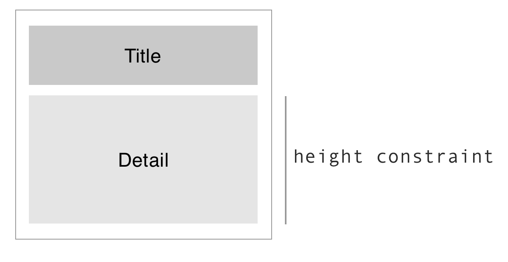

# ExpandableTableView

An easy to way expand/collapse table view cell by using Auto Layout feature in iOS.

## Introduction

Expand and collapse table view cell can be easy, with Auto Layout support. We assume there are two regions in each cell:

* **Title region** always visible.
* **Detail region** invisible by default, can be expanded to be visible.

Then we set a `detailLabelHeightConstraint`, representing the height of the detail region in a cell. By default, the height is set to `0`, making it collapse. When one taps the cell, change it to the real value, that is, expading the cell.

The picture bellow illustartes how it lays out.

 

## Example App

Please refer to the `ExpandableTableView.xcodeproj` project to see the example.